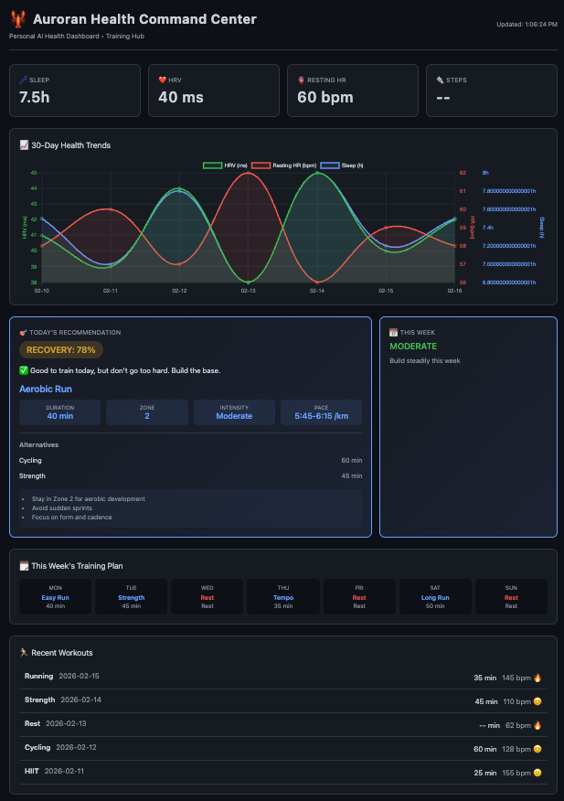

# Auroran Health Dashboard 🦞

**Personal Health Command Center** - Tracks fitness, recovery, and performance with multi-source integration.


---

## Status

**✅ Working:**
- **Strava:** 100+ workouts synced (no duplicates)
- **PMC:** CTL/ATL/TSB calculated from suffer_score
- **Dashboard:** http://localhost:5000 (Flask + Chart.js)
- **InfluxDB:** Time-series storage (bucket: `health`)

**PMC Calculus:**
- **Daily Training Load:** Sum of `suffer_score` from workouts
- **CTL (Fitness):** EMA(42 days) of daily load
- **ATL (Fatigue):** EMA(7 days) of daily load
- **TSB (Form):** CTL - ATL

---

## About

A comprehensive health monitoring and exercise planning system that collects data from wearable devices (Strava, Apple Health, Suunto, Garmin, Polar, Oura, Fitbit), stores it in InfluxDB, and provides AI-powered exercise recommendations through a beautiful web dashboard.

### Dashboard Preview



---

## Features

- 📊 **Real-time Health Metrics** - HRV, sleep, resting HR, steps tracking
- 📈 **PMC Charts** - CTL/ATL/TSB 30-day visualization
- 🧠 **AI Exercise Planner** - Recovery-based workout recommendations
- 📈 **Beautiful Dashboards** - Dark-theme UI with Chart.js visualizations
- 🔗 **Multi-source Integration** - Strava, Apple Health, and more
- 🏃 **Training Periodization** - Recovery/Base/Build/Peak weekly cycles
- 🎯 **Race Predictor** - Marathon/Half-marathon time predictions

---

## Architecture

```
┌─────────────────────────────────────────────────────────────────┐
│                    OpenClaw Container                            │
│  ┌──────────────┐  ┌──────────────┐  ┌──────────────────────┐ │
│  │   Strava    │  │  InfluxDB    │  │   Health Dashboard  │ │
│  │    API      │─▶│   (Time      │─▶│      (Web UI)       │ │
│  │  (Python)   │  │   Series)     │  │   (Flask + Chart)   │ │
│  └──────────────┘  └──────────────┘  └──────────────────────┘ │
│                                                                  │
│  ┌──────────────────────────────────────────────────────────┐  │
│  │              Exercise Planner (AI Recommendations)         │  │
│  │   - Recovery score based on HRV + Sleep + RHR           │  │
│  │   - Training load analysis                               │  │
│  │   - Weekly periodization                                │  │
│  └──────────────────────────────────────────────────────────┘  │
└─────────────────────────────────────────────────────────────────┘
```

**Key Principle:** Dashboard **never** reads from APIs directly. All data flows through InfluxDB.

```
Strava → sync_strava.py → InfluxDB → Dashboard
Apple Health → apple_health_sync.py → InfluxDB → Dashboard
Suunto → (pending API) → InfluxDB → Dashboard
```

---

## Vision

A comprehensive health monitoring and exercise planning system that collects data from multiple wearable devices and fitness platforms:

### Supported Data Sources

| Source | Type | Data Collected |
|--------|------|-----------------|
| **Strava** | ✅ Active | Workouts, calories, heart rate, GPS, suffer_score |
| **Apple Health** | ✅ Active | Sleep, HRV, resting HR, steps (via XML export) |
| **Suunto** | 🔄 Planned | Daily summaries, exercises, sleep, recovery |
| **Garmin** | 🔄 Planned | Activities, health metrics, training load |
| **Polar** | 🔄 Planned | Training load, sleep, recovery score |
| **Oura** | 🔄 Planned | Sleep, readiness, recovery, HRV |
| **Fitbit** | 🔄 Planned | Steps, sleep, HR, activity minutes |

The system stores all data in InfluxDB (time-series optimized) and provides:
- Beautiful web UI for visualization
- AI-powered exercise recommendations based on trends
- PMC (Performance Management Chart) for training analysis

---

## Database Schema (InfluxDB)

### Measurement: `daily_health`
| Field | Type | Description |
|-------|------|-------------|
| date | tag | Date (YYYY-MM-DD) |
| sleep_duration_hours | float | Total sleep |
| hrv_avg | float | Average HRV (ms) |
| hrv_std | float | HRV standard deviation |
| resting_hr | float | Average resting heart rate |
| steps | integer | Total steps |
| recovery_score | integer | 0-100 calculated score |
| training_load | float | Acute:chronic workload ratio |

### Measurement: `workouts`
| Field | Type | Description |
|-------|------|-------------|
| strava_id | tag | Unique Strava ID |
| type | tag | Running, Cycling, Ride, etc. |
| date | tag | Date |
| start_time | tag | Start time (HH:MM) |
| duration_minutes | float | Duration |
| avg_hr | float | Average heart rate |
| max_hr | float | Max heart rate |
| calories | integer | Estimated calories |
| distance | float | Distance (meters) |
| elevation_gain | float | Elevation (meters) |
| suffer_score | float | Strava effort score |
| name | string | Activity name |

### Measurement: `notes`
| Field | Type | Description |
|-------|------|-------------|
| date | tag | Date |
| alcohol | boolean | Had alcohol |
| stress_level | integer | 1-10 |
| notes | string | Free text |

---

## Web UI Components

### Dashboard (Single Page)
```
┌─────────────────────────────────────────────────────────────┐
│  🦞 Auroran Health Dashboard          [< Feb 21, 2026 >]  │
├─────────────────────────────────────────────────────────────┤
│                                                              │
│  ┌────────────┐ ┌────────────┐ ┌───────────┐ ┌─────────┐ │
│  │ 💤 Sleep   │ │ ❤️ HRV    │ │ 🫀 RHR   │ │ 👟 Steps│ │
│  │   7h 27m  │ │   42ms    │ │  58 bpm  │ │  8,432 │ │
│  │   +12m ▲  │ │   +5ms ▲  │ │  -2bpm ▼ │ │ +1.2k ▲ │ │
│  └────────────┘ └────────────┘ └───────────┘ └─────────┘ │
│                                                              │
│  ┌────────────┐ ┌────────────┐                             │
│  │ ⚖️ Weight  │ │ 🔥 Calories│                             │
│  │  72.4 kg  │ │   2,340   │                             │
│  │  -0.2kg ▼ │ │           │                             │
│  └────────────┘ └────────────┘                             │
│                                                              │
│  ┌────────────┐ ┌────────────┐ ┌───────────┐               │
│  │ 💪 CTL     │ │ 🔥 ATL    │ │ ⚖️ TSB   │               │
│  │  (Fitness)│ │  (Strain) │ │  (Form)  │               │
│  │    95     │ │    72     │ │   +23    │               │
│  └────────────┘ └────────────┘ └───────────┘               │
│                                                              │
│  ┌─────────────────────────────────────────────────────┐   │
│  │  📊 PMC - Performance Management (30-Day)           │   │
│  │     CTL line    █████████████████████████████████   │   │
│  │     ATL line    ██████████████████████████████      │   │
│  │     TSB line    ██████████████                      │   │
│  └─────────────────────────────────────────────────────┘   │
│                                                              │
│  ┌─────────────────────────────────────────────────────┐   │
│  │  📈 30-Day Health Trends                             │   │
│  │     HRV chart, Steps chart, Sleep chart              │   │
│  └─────────────────────────────────────────────────────┘   │
│                                                              │
│  ┌────────────────────────┐  ┌─────────────────────────┐  │
│  │  🎯 Today's Rec.        │  │  📅 This Week          │  │
│  │  Recovery: 85%         │  │  Mon: ✓ Easy Run       │  │
│  │  Run 45min Zone 2-3    │  │  Tue: ✓ Strength       │  │
│  └────────────────────────┘  └─────────────────────────┘  │
│                                                              │
│  ┌─────────────────────────────────────────────────────┐   │
│  │  🏃 Recent Workouts                                 │   │
│  │  • 5K Run - 28min - 145bpm - Feeling: Great       │   │
│  │  • Strength - 45min - Feeling: Good                │   │
│  └─────────────────────────────────────────────────────┘   │
│                                                              │
└─────────────────────────────────────────────────────────────┘
```

### Color Scheme
- Background: `#0d1117` (dark)
- Card BG: `#161b22`
- Primary: `#58a6ff` (blue)
- Success: `#3fb950` (green)
- Warning: `#d29922` (amber)
- Danger: `#f85149` (red)
- Text: `#c9d1d9`

---

## Exercise Planning Algorithm

### Recovery Score (0-100)
```
recovery = (
  hrv_percentile * 0.35 +
  sleep_quality * 0.30 +
  resting_hr_score * 0.20 +
  days_since_intense * 0.15
) * 100
```

### Training Recommendation Logic
| Recovery | Recommendation |
|----------|---------------|
| 85-100% | High intensity OK, push hard |
| 70-84% | Normal training, moderate load |
| 50-69% | Easy training, Zone 2 only |
| <50% | Rest or light mobility |

### Periodization (Weekly)
- **Recovery Week**: 2 hard days, 5 easy
- **Base Week**: 3 hard, 4 easy
- **Build Week**: 4 hard, 3 easy
- **Peak Week**: 5 hard, 2 easy
- **Deload Week**: 2 hard, 5 easy

---

## Setup

### Prerequisites
- Python 3.11+
- InfluxDB 2.x running
- (Optional) Strava API access

### Configuration

**1. Create `secrets.json`** (API credentials):
```json
{
  "influxdb_token": "your-token-here",
  "strava_client_id": "your-id",
  "strava_client_secret": "your-secret",
  "strava_refresh_token": "your-refresh-token"
}
```

**2. Create `smtp_config.json`** (for password reset emails):
```json
{
  "smtp_host": "smtp.auroranrunner.com",
  "smtp_port": 587,
  "smtp_user": "health@auroranrunner.com",
  "smtp_password": "YOUR_SMTP_PASSWORD",
  "smtp_from_email": "health@auroranrunner.com"
}
```
See `smtp_config.json.example` for template.

### Running

1. **Start InfluxDB:** `http://influxdb:8086` (org: `auroran`, bucket: `health`)
2. **Configure tokens:** `renew-strava-tokens/strava_tokens.json`
3. **Run dashboard:** `python3 app.py`
4. **Sync data:** See [USER_GUIDE.md](USER_GUIDE.md) for all sync commands

For detailed user instructions (Apple Health, Strava, Suunto imports, flags), see **[USER_GUIDE.md](USER_GUIDE.md)**.

### Cron (Optional)
```bash
# Sync Strava hourly
0 * * * * python3 /path/to/sync_strava.py
```

---

## API Endpoints

| Method | Endpoint | Description |
|--------|----------|-------------|
| GET | `/` | Dashboard UI |
| GET | `/api/health/today` | Today's metrics |
| GET | `/api/health/history?days=30` | Historical data |
| GET | `/api/workouts` | Workout list |
| GET | `/api/pmc?days=30` | PMC (CTL/ATL/TSB) |
| GET | `/api/recommendations/today` | AI workout recommendation |
| POST | `/api/workouts` | Log new workout |

---

## Logs
```
logs/health-dashboard.log
logs/strava_sync.log
```

---

## Data Source Integrations

### Strava Integration
Strava is the primary workout source. Use `sync_strava.py` to sync activities:
```bash
python3 sync_strava.py                    # Incremental (last 30 days)
python3 sync_strava.py --force            # Full sync (~3 years)
python3 sync_strava.py --newer-than 20240101  # Since specific date
```

### Apple Health Integration
Export your Apple Health data from iPhone and sync to InfluxDB:

1. **Export:** Use "Export Health Data" on iPhone (Health app → Profile → Export All Health Data)
2. **Place:** Copy `export.xml` into `apple_health_export/`
3. **Sync health:** `python3 apple_health_sync.py` (full) or `python3 apple_health_sync.py --days 2` (quick update)
4. **Sync calories:** `python3 import_apple_calories.py --days 2`

See [USER_GUIDE.md](USER_GUIDE.md) for all flags.

### Suunto API Integration (Planned)

**OAuth Flow:**
1. Register at apizone.suunto.com as developer
2. Create app to get Client ID + Secret
3. OAuth URL: `https://apizone.suunto.com/oauth/authorize`
4. Token endpoint: `https://apizone.suunto.com/oauth/token`

**Key Endpoints:**
- `/dailies` - Daily summaries (steps, HR, sleep)
- `/exercises` - Workout data
- `/sleeps` - Sleep analysis (HRV during sleep)
- `/recovery` - Daily recovery recommendations

**Data Fields to Collect:**
- `daySummary`: steps, distance, calories, HR
- `sleepSummary`: duration, deep sleep, REM, HRV
- `exerciseSamples`: HR, speed, power (if available)

---

## Future Enhancements

- [ ] Garmin Connect API integration
- [ ] Polar Flow API integration
- [ ] Oura ring integration
- [ ] Fitbit API integration
- [ ] Push notifications for daily recommendations
- [ ] Voice commands via TTS
- [ ] Meal logging
- [ ] Weight/body composition tracking
- [ ] Weather-aware outdoor exercise planning
- [ ] Sleep debt calculator
- [ ] Training zone calculator (from lactate or HR)

---

## License

MIT License 🦞
